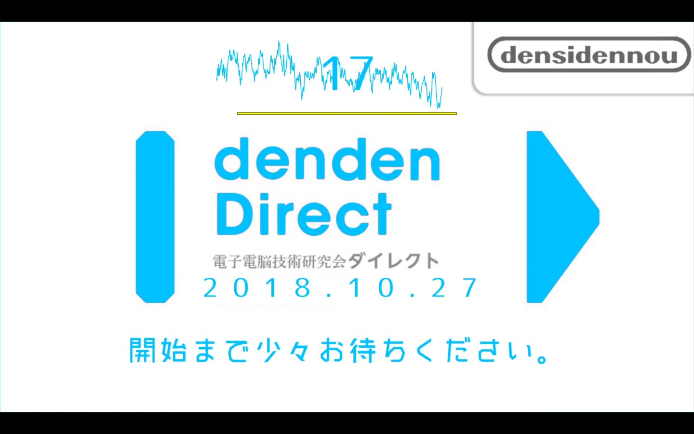

# アラート


Twitterで[フォロー](https://twitter.com/intent/follow?screen_name=yuubinnkyoku_mk)してね！


 

# 記事へのリンク



 

# バッジ


New article!


 

# ボタン


ボタンを押す


 
 

# スライドショー



 

# 棒グラフ


type: 'bar',
data: {
  labels: ['yuubinnkyoku', 'kusaann', 'moa', 'kf25' , 'sawasawa' , 'sawayan'],
  datasets: [{
    label: '登録者数',
    data: [144, 187000, 54800, 16200, 9370, 1960000],
  }]
}


 

# 折れ線グラフ


type: 'line',
data: {
  labels: ['1月', '2月', '3月', '4月', '5月', '6月', '7月'],
  datasets: [{
    label: '初めてのデータセット',
    data: [65, 59, 80, 81, 56, 55, 40],
    tension: 0.2
  }]
}

 

# 円グラフ


type: 'doughnut',
data: {
  labels: ['赤色', '青色', '黄色'],
  datasets: [{
    label: '初めてのデータセット',
    data: [300, 50, 100],
    backgroundColor: [
      'rgba(255, 99, 132, 0.7)',
      'rgba(54, 162, 235, 0.7)',
      'rgba(255, 205, 86, 0.7)'
    ],
    borderWidth: 0,
    hoverOffset: 4
  }]
}

 

# Code Import



# Figure(画像挿入)

 on [Unsplash](https://unsplash.com/)")

# ギャラリー


  
  
  
